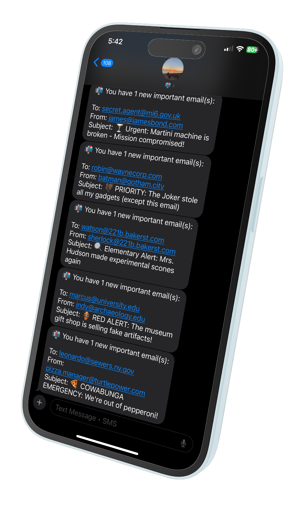

Gmail to SMS Notifier via Twilio

<div align="center">

<br>
<em>📱 See your important emails instantly - never miss what matters!</em>
</div>

## The Problem This Solves

Are you tired of constantly checking email, worried you'll miss something important? Do critical messages get buried in your inbox while you're trying to focus on deep work? 

I created this tool because I was spending too much mental energy on email anxiety. I needed a way to:
- ✅ Stop obsessively checking Gmail throughout the day
- ✅ Never let another important email get buried in my inbox
- ✅ Focus on meaningful work without FOMO about missing urgent messages
- ✅ Get instant notifications only for emails that actually matter

## The Solution

This project provides a Google Apps Script that connects your Gmail account to Twilio. It automatically sends an SMS notification to your phone when you receive an email that matches specific senders, subject lines, or keywords you define.

**Key Benefits:**
- 📱 Instant SMS alerts for important emails only
- 🎯 Customizable filters (keywords, senders, subjects) 
- 🔒 Runs securely in your own Google Account
- 🚀 No server hosting required - uses Google Apps Script
- ⚡ Set-and-forget automation

This tool is designed for personal use, giving you peace of mind and increased productivity by ensuring you never miss what matters while eliminating email-checking compulsion.

## How It Works & Your Opt-In Consent
This script runs entirely within your own Google Account. You are in complete control of your data and the notifications you receive.
Regarding Twilio's Policies: By following this guide to set up and configure this script with your own phone number, you are providing explicit, direct consent to receive automated SMS messages from your own system. This is a "self-service" notification tool you are building for yourself. This setup is intended for individual use and complies with carrier policies by ensuring you are the sole sender and recipient.

## Setup Guide

Follow these steps to get your notification system running.

### Prerequisites
- **Google Account**: Your personal Gmail address
- **Twilio Account**: A free or paid account at [twilio.com](https://twilio.com)
- **Twilio Phone Number**: A number purchased from your Twilio account that can send SMS messages

### Step 1: Get Your Twilio Credentials
Log in to your [Twilio Console](https://console.twilio.com) and find these three values:
- **Account SID**: Your unique account identifier
- **Auth Token**: Your account's secret key  
- **Twilio Phone Number**: The number you purchased from Twilio

### Step 2: Create the Google Apps Script
1. Go to [script.google.com](https://script.google.com) and click **New project**
2. Delete any existing code in the editor
3. Copy the code from `Code.gs` and `ConfigSidebar.html` files in this repository
4. In Apps Script, create two files:
   - Rename `Code.gs` and paste the Google Apps Script code
   - Click **+** → **HTML file** → name it `ConfigSidebar` and paste the HTML code
5. **Save your project** (Ctrl/Cmd + S)

### Step 3: Configure Using the Built-in Interface
This project includes a user-friendly configuration interface:

1. **Run the setup function** by clicking the **▶️ Run** button in Apps Script
2. **Or** open Gmail/Google Sheets and look for the "Gmail Alerts" menu
3. Click **Configure** to open the configuration sidebar
4. Fill in your:
   - Twilio credentials (SID, Auth Token, Phone Numbers)  
   - Keywords you want to monitor
   - Important sender email addresses
   - Check frequency (how often to scan for new emails)

### Step 4: Handle Google Authorization ⚠️

**Important**: When you first run the script, Google will show security warnings because this is a personal script, not a published app. This is normal and expected.

#### You'll see this warning screen:

**You'll see a screen like this:**
```
🛑 Google hasn't verified this app

The app is requesting access to sensitive info in your Google Account. 
Until the developer ([your-email]) verifies this app with Google, you shouldn't use it.

                    [Hide Advanced]    [BACK TO SAFETY]

Continue only if you understand the risks and trust the developer
([your-email]).

                    Go to [YourProjectName] (unsafe)
```

**What to do:**
1. Click "**Advanced**" (this will show more options)  
2. Click "**Go to [YourProjectName] (unsafe)**"

#### Then you'll see the permissions screen:

**You'll see a detailed permissions screen like this:**
```
📧 [YourProjectName] wants to access your Google Account

This will allow [YourProjectName] to:
 📧  Read, compose, send, and permanently delete all your email from Gmail
 📄  View and manage documents that this application has been installed in  
 📊  View and manage spreadsheets that this application has been installed in
 🌐  Connect to an external service
 ⏰  Allow this application to run when you are not present
 🔧  Display and run third-party web content in prompts and sidebars

Make sure you trust [YourProjectName]

                        [Advanced]      [Allow]
```

<!-- Screenshots available in imgs/ folder:
- Screenshot 2025-08-31 at 1.57.04 PM.png (Google verification warning)  
- Screenshot 2025-08-31 at 1.57.22 PM.png (Authorization permissions screen)
-->

**Review the permissions carefully:**
- ✅ **Read Gmail**: Needed to scan for matching emails
- ✅ **External connections**: Needed to send SMS via Twilio  
- ✅ **Run when not present**: Needed for automatic checking

3. Click "**Allow**" if you trust the code (you can review it first!)

### Step 5: Set Up Automatic Monitoring
1. In the configuration interface, click "**Setup Automatic Trigger**"
2. **Or** manually in Apps Script:
   - Click **Triggers** (⏰ icon) on the left
   - Click **Add Trigger**
   - Function: `processEmails`
   - Event source: **Time-driven**
   - Type: **Minutes timer** 
   - Interval: **Every 5-10 minutes** (your choice)

### Step 6: Test Your Setup
1. Click "**Run Now**" in the configuration interface to test immediately
2. Send yourself a test email with one of your monitored keywords
3. You should receive an SMS within your configured time interval

## Alternative Configuration (Advanced Users)

If you prefer to configure manually via Script Properties:

1. In Apps Script, click **Project Settings** (⚙️ icon)
2. Scroll to **Script Properties** → **Add script property**
3. Add these properties:

| Property Name | Example Value |
|--------------|---------------|
| `keywords` | `["urgent", "alert", "important"]` |
| `senders` | `["boss@company.com", "alerts@service.com"]` |
| `alertTypes` | `["twilio"]` |
| `twilioAccountSid` | `AC1234567890abcdef` |
| `twilioAuthToken` | `your_auth_token_here` |
| `twilioFromNumber` | `+15551234567` |
| `twilioToNumber` | `+15559876543` |
That's it! Your notifier is now active. To test it, send yourself an email with a subject or keyword from your watchlist. You should receive an SMS within the time interval you set.

## Contributing

We welcome contributions! Please see [CONTRIBUTING.md](CONTRIBUTING.md) for guidelines on:
- Reporting issues
- Submitting pull requests  
- Development setup
- Code style guidelines

## License

This project is licensed under the MIT License - see the [LICENSE](LICENSE) file for details.

## Support

- 🐛 **Found a bug?** Open an [issue](../../issues)
- 💡 **Have a feature idea?** Open an [issue](../../issues) 
- 🤝 **Want to contribute?** Check our [contributing guide](CONTRIBUTING.md)

## Disclaimer

This tool is for personal use only. Users are responsible for complying with their email provider's terms of service and applicable laws regarding automated email monitoring.
